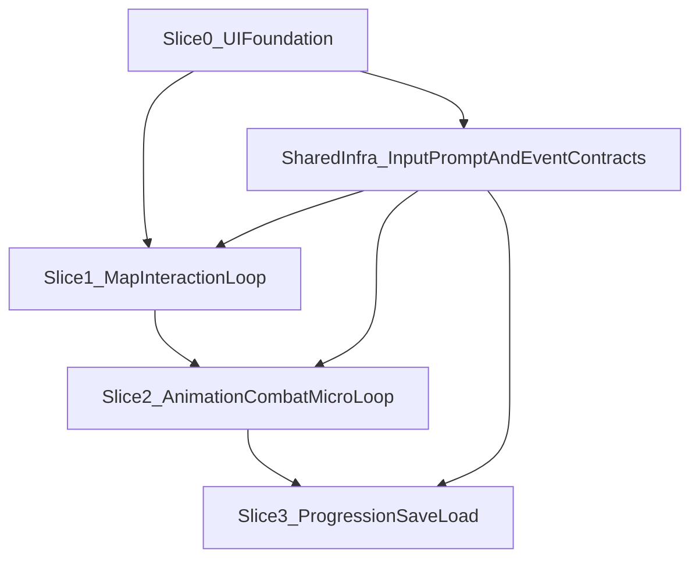

# Vertical Slice Roadmap (Slices 0-3)

**Date:** 2026-03-17  
**Purpose:** Convert pre-production intent into a decision-oriented roadmap with measurable gates and minimal architectural overhead.

---

## 1) Roadmap principles

- Build one reliable loop at a time.
- Keep map static data separate from runtime behavior.
- Standardize trigger contracts early to avoid map-specific script drift.
- Automate deterministic flows; keep feel/readability evaluation manual early.
- Ship each slice with explicit go/no-go criteria.

---

## 2) Slice dependency map

---

## 3) Slice 0: UI Foundation + Menus

## Scope
- Main menu, pause menu, options (audio/display/controls placeholders), credits.
- Input prompt framework (PS4 icon mapping + keyboard fallback stubs).
- Base UI style pass (Monogram typography, spacing, focus visuals).
- Dummy gameplay scene that can open/close pause and one in-game overlay.

## Out of scope
- Combat, AI, progression logic, content-heavy maps.

## Required test gates
- Manual:
  - All forward/back/cancel paths complete without dead-end UI states.
  - Focus ring/state always visible.
- Automation:
  - Smoke path: launch -> main -> options -> back -> start -> pause -> resume.
  - Settings apply/reopen consistency check.

## Exit criteria (measurable)
- Controller and keyboard navigation pass for all menu graphs.
- 10/10 repeated menu traversal runs with deterministic focus order.
- 0 blocker UX issues in heuristic pass.
- Credits include PS4 Buttons attribution placeholder (CC BY 4.0).

## Key risks and mitigation
- **Risk:** Focus behavior diverges across input devices.  
  **Mitigation:** Single focus manager and explicit navigation graph.
- **Risk:** UI architecture isolated from runtime scenes.  
  **Mitigation:** Dummy gameplay overlay integration in this slice.

---

## 4) Slice 1: Map Interaction Loop

## Scope
- One small greybox map using prototype textures.
- Player spawn + one interactable trigger + one exit trigger.
- Thin map director flow: trigger -> state change -> success/transition.
- Trigger debug view (volumes, IDs) + event counter logging.

## Out of scope
- Expanded combat depth, complex AI behaviors, multi-map progression.

## Required test gates
- Manual:
  - Playthrough confirms critical path clarity and no soft-lock route.
- Automation:
  - Critical trigger path smoke test (start -> objective trigger -> exit).
  - Trigger determinism check with per-trigger event count assertions.

## Exit criteria (measurable)
- Critical path succeeds 20/20 repeated runs.
- No critical trigger fires unexpectedly outside intended conditions.
- 0 soft-locks on critical route.

## Key risks and mitigation
- **Risk:** Trigger ID mismatch between map and scripts.  
  **Mitigation:** centralized trigger schema + load-time validator.
- **Risk:** map director accumulates system logic.  
  **Mitigation:** enforce orchestration-only rule in code review checklist.

---

## 5) Slice 2: Animation + Combat Micro-loop

## Scope
- One enemy archetype.
- Player basic attack and hit-reaction loop.
- Minimal health/death for both sides.
- Combat HUD indicators (health/resource, hit feedback prompt where relevant).
- Animation test scene for key state transitions.

## Out of scope
- Large enemy roster, advanced combo trees, balance tuning for production.

## Required test gates
- Manual:
  - Combat readability pass (telegraph clarity, hit confirmation, reaction timing).
- Automation:
  - Rapid-input transition stress test.
  - Basic encounter completion smoke path.

## Exit criteria (measurable)
- No state-machine dead-end under a 5-minute rapid-input stress loop.
- Hit feedback and damage readability pass in QA checklist.
- Encounter can be completed repeatedly without desync/logic dead-end.

## Key risks and mitigation
- **Risk:** Retargeting/blend artifacts across rigs.  
  **Mitigation:** compatibility matrix + transition scene before tuning.
- **Risk:** Combat loop tight-coupled to specific map scene.  
  **Mitigation:** isolate combat systems from map-authoring details.

---

## 6) Slice 3: Progression + Save/Load Sanity

## Scope
- Minimal progression flags.
- Save/load round-trip.
- Return-to-menu and resume flow.
- Deterministic restoration for tested state set.

## Out of scope
- Full narrative progression, multiple save slots, migration framework.

## Required test gates
- Manual:
  - Resume behavior sanity pass from menu and in-map checkpoints.
- Automation:
  - Save/load round-trip smoke assertions for map ID + progression flags + minimal player state.

## Exit criteria (measurable)
- 20/20 save-load-restart cycles restore expected tested state.
- 0 critical restore mismatches in smoke suite.

## Key risks and mitigation
- **Risk:** save contract undefined until late.  
  **Mitigation:** define explicit save schema before first implementation.
- **Risk:** nondeterministic restore due to hidden runtime dependencies.  
  **Mitigation:** whitelist persisted fields and assert each on load.

---

## 7) Cross-slice tooling timeline

## P0 (before or during Slice 0)
- Menu smoke automation.
- Focus/navigation deterministic checks.
- Trigger/debug overlay scaffolding.
- Attribution checklist item for CC BY assets.

## P1 (Slices 1-2)
- Trigger path automation + event counters.
- Animation transition test scene + checklist.
- Telemetry (scene load times, deaths, trigger counts, menu funnel drop-offs).

## P2 (Slices 2-3+)
- Expanded regression suite across slices.
- Performance budget checks integrated with pre-release checklist.
- Controller prompt abstraction for broader device support.

---

## 8) Go/No-Go gate for full production start

Proceed to broader implementation only if all are true:

- UI shell stable with deterministic focus/nav behavior.
- One map interaction loop proven and repeatable.
- One combat/animation loop proven and readable.
- Save/load round-trip deterministic for defined fields.
- Smoke tests catch regressions in all proven loops.

If any gate fails, resolve at current slice before adding content scope.

